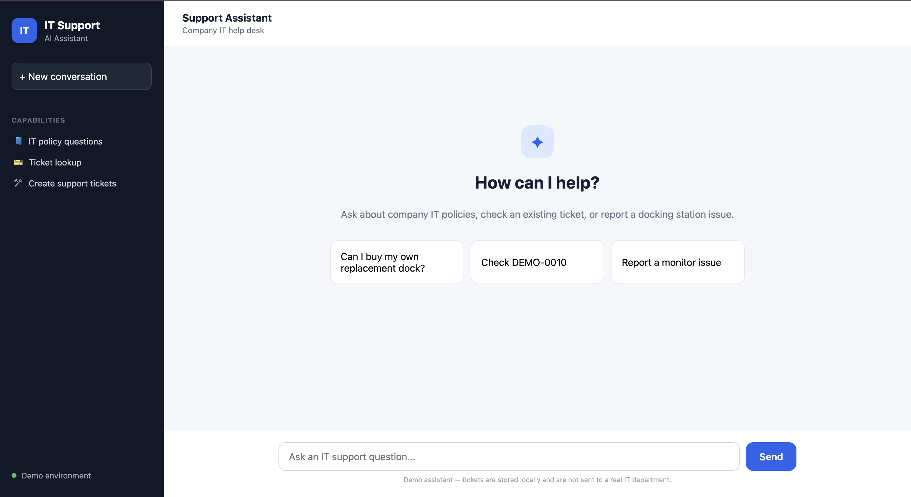
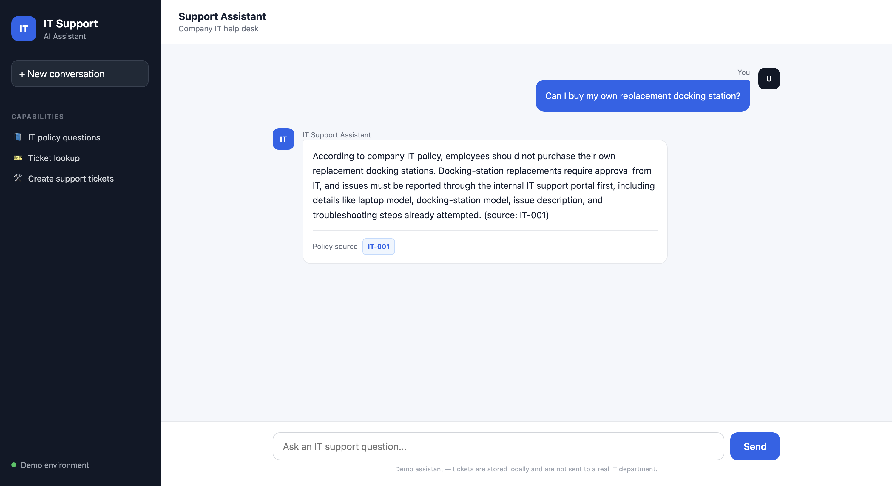
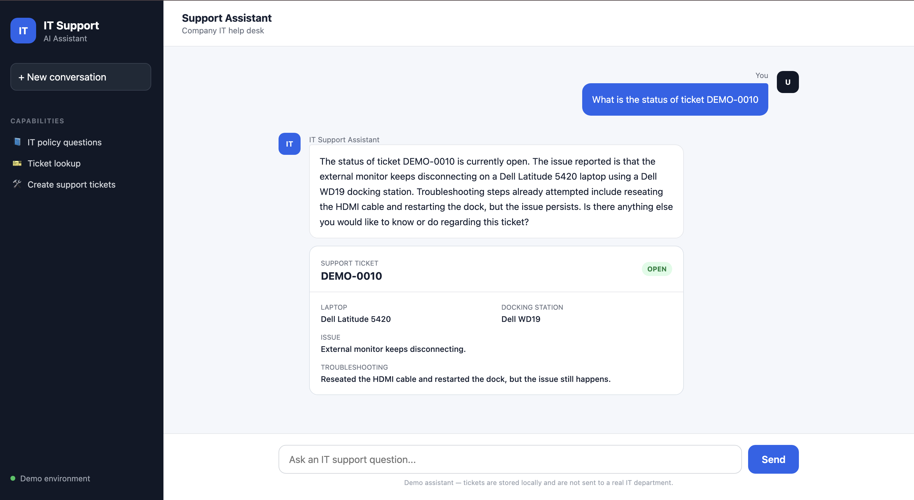
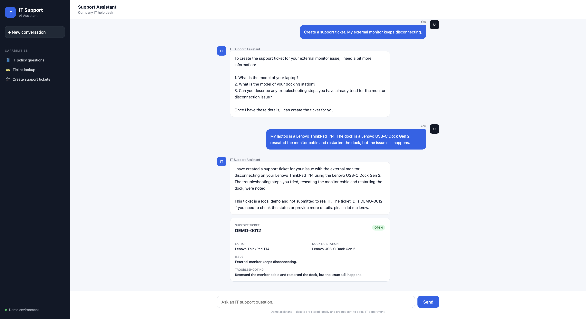
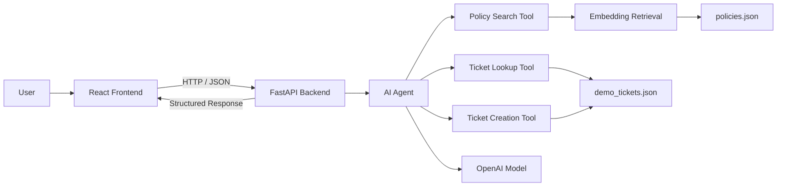

# IT Support Assistant

AI-powered IT help desk that answers company policy questions, retrieves support tickets, and creates new tickets through a conversational interface.

Built with **React + TypeScript**, **FastAPI**, **OpenAI tool calling**, semantic retrieval with embeddings, and automated testing.

[Live Demo](https://it-support-assistant-theta.vercel.app) •
[Backend API](https://it-support-assistant-kmkm.onrender.com) •
[API Docs](https://it-support-assistant-kmkm.onrender.com/docs)


---

## Live Application



The application supports three main workflows:

- Ask questions about company IT policies
- Look up existing support tickets
- Create new support tickets through a multi-turn conversation

---

## Demo

### Policy Search

Users can ask questions such as:

> Can I buy my own replacement docking station?

The assistant retrieves the most relevant IT policy using embeddings and cosine similarity.

The policy source is returned separately from the generated response and rendered as a structured badge.



---

### Ticket Lookup

Users can retrieve an existing support ticket by ID:

> What is the status of ticket DEMO-0010?

The backend retrieves the stored ticket and returns structured ticket data to the React frontend.



---

### Ticket Creation

Users can create a support ticket conversationally:

> Create a support ticket. My external monitor keeps disconnecting.

If information is missing, the assistant asks for the remaining details before creating the ticket.

Required information includes:

- Laptop model
- Docking station model
- Issue description
- Troubleshooting already attempted

Once complete, a new ticket is created and displayed as a structured card.



---

## Features

| Feature | Description |
|---|---|
| AI Support Chat | Conversational interface for IT support requests |
| Policy Retrieval | Semantic search using OpenAI embeddings |
| Tool Calling | LLM selects backend functions based on user intent |
| Ticket Lookup | Retrieves stored support tickets by ticket ID |
| Ticket Creation | Collects missing information before creating a ticket |
| Multi-turn Context | Maintains conversation history using session IDs |
| Structured Responses | Backend returns policy IDs and ticket objects separately from generated text |
| React UI | Displays policy badges and structured ticket cards |
| FastAPI Backend | Provides REST API communication between frontend and AI system |
| Persistent Local Storage | Demo tickets are written to JSON |
| Automated Testing | 9 pytest tests covering retrieval, tickets, and agent routing |
| Deployment | React on Vercel and FastAPI on Render |

---

## Tech Stack

### Frontend

- React
- TypeScript
- Vite
- CSS
- Fetch API

### Backend

- Python
- FastAPI
- Pydantic
- Uvicorn

### AI

- OpenAI API
- `gpt-4.1-mini`
- `text-embedding-3-small`
- Tool calling
- Embeddings
- Cosine similarity

### Data

- JSON
- NumPy

### Testing

- pytest

### Deployment

- Vercel — frontend
- Render — backend

---

## Architecture



The deployed architecture is:

```text
User Browser
     |
     v
Vercel
React + TypeScript
     |
     | HTTPS / JSON
     v
Render
FastAPI + Python
     |
     v
AI Agent
   /     \
  v       v
Policy   Ticket
Search    Tools
```

---

## How It Works

### 1. React Frontend

The frontend handles:

- chat messages
- loading state
- conversation display
- source badges
- ticket cards
- session IDs
- communication with the FastAPI backend

The frontend sends requests to:

```text
POST /chat
```

Example request:

```json
{
  "question": "What is the status of ticket DEMO-0010?",
  "session_id": "example-session-id"
}
```

---

### 2. FastAPI Backend

FastAPI acts as the bridge between the React interface and the AI system.

The backend:

1. Receives the user message
2. Finds or creates the conversation session
3. Passes the message to the AI agent
4. Executes any requested tools
5. Extracts structured tool results
6. Sends the final response back to React

Example response:

```json
{
  "response": "Ticket DEMO-0010 is currently open.",
  "session_id": "example-session-id",
  "source_id": null,
  "ticket": {
    "ticket_id": "DEMO-0010",
    "status": "open",
    "laptop_model": "Dell Latitude 5420",
    "docking_station_model": "Dell WD19",
    "issue_description": "External monitor keeps disconnecting.",
    "troubleshooting_steps": "Reseated the HDMI cable and restarted the dock."
  }
}
```

Returning structured data allows React to create dedicated UI components instead of trying to extract information from generated text.

---

## AI Agent

The main agent logic lives in:

```text
src/agent.py
```

The agent receives:

- the user message
- previous conversation history
- available tools
- indexed policy data

The LLM does not directly execute Python functions.

Instead:

```text
User Request
     |
     v
LLM
     |
     | requests a tool
     v
agent.py
     |
     v
Python Function
     |
     | returns result
     v
LLM
     |
     v
Final Response
```

---

## Tool Calling

The model has access to three tools:

### `search_it_policy`

Used for company IT policy questions.

Examples:

- Can I buy my own replacement dock?
- How do I reset my password?
- What should I do if my VPN fails?

---

### `get_ticket`

Used when a user asks for the status or details of an existing ticket.

Example:

```text
What is the status of DEMO-0010?
```

---

### `create_dock_ticket`

Used when the user wants to create a docking-station support ticket.

The tool requires:

```text
laptop_model
docking_station_model
issue_description
troubleshooting_steps
```

The assistant asks for any missing information before calling the tool.

---

## Semantic Policy Retrieval

Company IT policies are stored in:

```text
data/policies.json
```

When the backend starts:

1. Policy text is loaded
2. Each policy is converted into an embedding
3. The embeddings are stored in memory

When a user asks a policy question:

1. The user's question is converted into an embedding
2. The query vector is compared against every policy vector
3. Cosine similarity calculates the semantic similarity
4. The highest-scoring policy is returned

Conceptually:

```text
User Question
     |
     v
Embedding
     |
     v
Compare with policy embeddings
     |
     v
Cosine Similarity
     |
     v
Best Matching Policy
```

Example:

```text
"Can I buy my own replacement docking station?"
                     |
                     v
                   IT-001
```

The retrieval similarity score is used for ranking and is not treated as model confidence.

---

## Ticket System

Demo support tickets are stored in:

```text
data/demo_tickets.json
```

Example ticket:

```json
{
  "ticket_id": "DEMO-0011",
  "status": "open",
  "laptop_model": "Lenovo ThinkPad T14",
  "docking_station_model": "Lenovo USB-C Dock Gen 2",
  "issue_description": "External monitor keeps disconnecting.",
  "troubleshooting_steps": "Reseated the monitor cable and restarted the dock."
}
```

When a new ticket is created:

```text
Load existing tickets
       |
       v
Find largest ticket number
       |
       v
Generate next ID
       |
       v
Create ticket dictionary
       |
       v
Append ticket
       |
       v
Write updated JSON file
```

---

## Conversation Sessions

HTTP requests are independent from each other.

To maintain conversation context, the backend assigns each conversation a:

```text
session_id
```

The React frontend stores this ID and sends it with future messages.

Example:

```text
Message 1
"Create a support ticket. My monitor disconnects."
        |
        v
Backend creates session
        |
        v
Assistant asks for missing details
        |
        v
React stores session_id
        |
        v
Message 2 + same session_id
"My laptop is a ThinkPad T14..."
        |
        v
Backend retrieves previous history
```

This allows multi-turn ticket creation to work across separate HTTP requests.

---

## Project Structure

```text
IT-Support-Assistant/
│
├── backend/
│   └── main.py
│
├── data/
│   ├── demo_tickets.json
│   └── policies.json
│
├── front/
│   ├── public/
│   ├── src/
│   │   ├── App.tsx
│   │   ├── App.css
│   │   ├── index.css
│   │   └── main.tsx
│   ├── package.json
│   ├── package-lock.json
│   ├── index.html
│   └── vite.config.ts
│
├── src/
│   ├── __init__.py
│   ├── agent.py
│   ├── retrieval.py
│   ├── tickets.py
│   └── tools.py
│
├── tests/
│   ├── test_agent.py
│   ├── test_retrieval.py
│   └── test_tickets.py
│
├── .env.example
├── .gitignore
├── .python-version
├── README.md
└── requirements.txt
```

---

## Running Locally

### 1. Clone the Repository

```bash
git clone https://github.com/alidanmir/IT-Support-Assistant.git
cd IT-Support-Assistant
```

---

### 2. Install Backend Dependencies

```bash
python -m pip install -r requirements.txt
```

---

### 3. Configure the API Key

Create:

```text
.env
```

in the project root.

Add:

```text
OPENAI_API_KEY=your_api_key_here
```

Do not commit this file.

The repository includes:

```text
.env.example
```

as a configuration example.

---

### 4. Start the FastAPI Backend

```bash
python -m uvicorn backend.main:app --reload
```

Backend:

```text
http://127.0.0.1:8000
```

API documentation:

```text
http://127.0.0.1:8000/docs
```

---

### 5. Install Frontend Dependencies

Open another terminal:

```bash
cd front
npm install
```

---

### 6. Start the React Frontend

```bash
npm run dev
```

The application will normally run at:

```text
http://localhost:5173
```

---

## Testing

The project currently contains nine automated tests.

Run:

```bash
python -m pytest -v
```

Current result:

```text
9 passed
```

### Ticket Tests

- ticket data loads as a list
- existing tickets can be retrieved
- missing tickets return an error

### Retrieval Tests

- docking-station questions return `IT-001`
- password questions return `IT-002`
- VPN questions return `IT-003`

### Agent Tests

- policy questions trigger `search_it_policy`
- ticket status questions trigger `get_ticket`
- missing ticket IDs cause the assistant to ask for the ID instead of inventing one

---

## Deployment

### Frontend

Hosted on **Vercel**:

https://it-support-assistant-theta.vercel.app

Vercel serves the compiled React frontend to the user's browser.

---

### Backend

Hosted on **Render**:

https://it-support-assistant-kmkm.onrender.com

API documentation:

https://it-support-assistant-kmkm.onrender.com/docs

Render runs the FastAPI Python server.

---

## Deployment Architecture

```text
GitHub
   |
   +--------------------------+
   |                          |
   v                          v
Vercel                     Render
Frontend                   Backend
React                      FastAPI
   |                          |
   +---------- HTTPS ---------+
                              |
                              v
                         OpenAI API
```

Both Vercel and Render are connected to GitHub and automatically redeploy when changes are pushed to the repository.

---

## Security

The OpenAI API key is never stored in the repository.

The local `.env` file is excluded through:

```text
.gitignore
```

Production uses the `OPENAI_API_KEY` environment variable configured directly in Render.

CORS restricts API requests to approved frontend origins.

---

## Important Demo Limitation

The ticket system currently uses:

```text
data/demo_tickets.json
```

for storage.

This works locally, but the deployed Render filesystem is not intended to act as permanent application storage.

Tickets created in the public demo may disappear after a server restart or redeployment.

A production version would replace JSON storage with a persistent database such as PostgreSQL.

---

## What I Learned

This project gave me practical experience with:

- building AI agents
- OpenAI tool calling
- embeddings
- semantic retrieval
- cosine similarity
- multi-turn conversation state
- session IDs
- connecting LLMs to Python functions
- structured AI responses
- FastAPI REST APIs
- React
- TypeScript
- frontend/backend communication
- asynchronous API requests
- persistent application data
- pytest testing
- Git and GitHub
- CORS
- environment variables
- Vercel deployment
- Render deployment

---

## Future Improvements

Potential improvements include:

- PostgreSQL ticket storage
- authentication
- individual user accounts
- technician assignment
- ticket priority
- ticket severity
- timestamps
- ticket resolution history
- additional IT policies
- support for more issue categories
- searchable ticket dashboard
- conversation persistence in a database
- real ServiceNow integration
- Jira Service Management integration
- admin dashboard
- production logging and monitoring

---

## Disclaimer

This project is a portfolio and development demonstration.

Support tickets created by the assistant are local demo tickets and are not submitted to a real IT department.